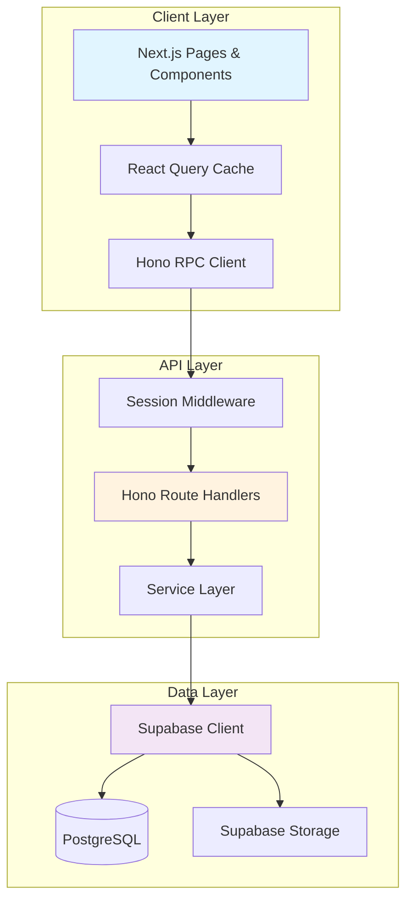

# Trello Next.js - Project Documentation

## Project Goals & Vision

### What Problem This Application Solves

This application is a **collaborative project management platform** inspired by Trello, designed to help teams organize, track, and manage work in a visual and intuitive way. It solves several key challenges:

- **Project Organization**: Provides a structured way to organize work across multiple workspaces, projects, and tasks
- **Team Collaboration**: Enables real-time collaboration with team members, including task assignments, comments, and activity tracking
- **Visual Task Management**: Implements a Kanban-style board interface for intuitive task flow visualization
- **Deadline Tracking**: Helps teams stay on schedule with calendar views and deadline management
- **Multi-workspace Support**: Allows users to segregate different projects/clients into separate workspaces

### Target Users

- **Small to Medium Teams**: Development teams, product teams, marketing teams needing lightweight project management
- **Freelancers & Consultants**: Individuals managing multiple client projects simultaneously
- **Startups**: Teams that need quick setup and intuitive collaboration without enterprise overhead
- **Remote Teams**: Distributed teams requiring asynchronous collaboration and visibility

### Success Criteria

**Performance**

- Page load times < 2s on average connection
- Optimistic UI updates for instant user feedback
- Efficient data fetching with React Query caching

**Scalability**

- Feature-based modular architecture allows horizontal growth
- Database design supports multi-tenancy (workspaces)
- Type-safe API contracts via Hono RPC prevent runtime errors at scale

**Usability**

- Intuitive drag-and-drop task management
- Responsive design (mobile, tablet, desktop)
- Dark mode support for accessibility
- Real-time updates via Supabase subscriptions

---

## Tech Stack & Dependencies

### Core Technologies

#### **Next.js 16.0.10** (React 19.2.1)

- **Why Chosen**: Industry-leading React framework with built-in routing, SSR/SSG, and excellent DX
- **Alternatives Considered**:
  - *Remix*: More traditional multi-page app feel, but Next.js has better ecosystem
  - *Vite + React Router*: More lightweight but lacks SSR capabilities
- **Trade-offs**: Accepts some vendor lock-in for superior performance and developer experience

#### **Supabase** (@supabase/supabase-js ^2.89.0, @supabase/ssr ^0.8.0)

- **Why Chosen**:
  - Open-source Firebase alternative with PostgreSQL backing
  - Built-in authentication, real-time subscriptions, and storage
  - Type-safe database access with auto-generated TypeScript types
- **Alternatives Considered**:
  - *Firebase*: Easier onboarding but limited query flexibility and NoSQL constraints
  - *Custom PostgreSQL + Auth0*: More control but significantly more setup overhead
- **Trade-offs**: Some vendor lock-in, but migration path exists via PostgreSQL export

#### **Hono** (^4.11.2)

- **Why Chosen**:
  - Ultra-lightweight, edge-optimized API framework
  - Type-safe RPC with automatic client generation
  - Seamlessly integrates with Next.js Route Handlers
- **Alternatives Considered**:
  - *tRPC*: More popular but heavier runtime overhead
  - *Next.js API Routes*: Less type-safety, no RPC pattern
- **Trade-offs**: Smaller community than tRPC, but significantly faster

#### **TanStack Query (React Query)** (^5.90.12)

- **Why Chosen**:
  - Industry standard for server state management
  - Automatic caching, refetching, and optimistic updates
  - Excellent DevTools for debugging
- **Alternatives Considered**:
  - *SWR*: Simpler but less feature-rich
  - *Redux + RTK Query*: More boilerplate, heavier bundle
- **Trade-offs**: Requires understanding of cache invalidation patterns

### UI & Styling

#### **Radix UI Primitives**

- Comprehensive set of unstyled, accessible components
- Includes: Dialog, Dropdown, Select, Tabs, Tooltip, Avatar, Checkbox, etc.
- **Why Chosen**: Accessibility out-of-the-box, full control over styling

#### **Tailwind CSS v4**

- **Why Chosen**: Rapid prototyping, small production bundles, excellent DX
- **Configuration**: PostCSS setup with custom animations via `tw-animate-css`

#### **next-themes** (^0.4.6)

- Dark mode support with system preference detection

#### **lucide-react** (^0.561.0)

- Modern, tree-shakeable icon library

### Form Handling & Validation

#### **React Hook Form** (^7.69.0)

- Performant form library with minimal re-renders
- Integrated with Zod for validation

#### **Zod** (^4.2.1)

- Runtime type validation
- Schema sharing between client and server
- **Why Chosen**: Type-safe validation with excellent TypeScript inference

#### **@hookform/resolvers** (^5.2.2)

- Bridge between React Hook Form and Zod

### Drag & Drop

#### **@hello-pangea/dnd** (^18.0.1)

- Fork of react-beautiful-dnd with React 19 support
- **Why Chosen**: Most mature drag-and-drop library for lists/boards

### Data Visualization

#### **Recharts** (2.15.4)

- Composable chart library for dashboard analytics
- **Why Chosen**: Declarative API, good TypeScript support

### Utilities

- **date-fns** (^4.1.0): Date manipulation (lighter than Moment.js)
- **clsx** (^2.1.1) + **tailwind-merge** (^3.4.0): Conditional className composition
- **class-variance-authority** (^0.7.1): Type-safe variant styling
- **sonner** (^2.0.7): Toast notifications

### Testing

#### **Vitest** (^4.0.16)

- **Why Chosen**: Vite-native test runner, significantly faster than Jest
- Configured with jsdom environment for component testing

#### **Testing Library** (@testing-library/react ^16.3.1)

- Industry standard for React component testing
- Encourages accessibility-focused tests

---

## Configuration & Tooling

### ESLint Configuration

```javascript
// eslint.config.mjs
import { defineConfig, globalIgnores } from 'eslint/config';
import nextVitals from 'eslint-config-next/core-web-vitals';
import nextTs from 'eslint-config-next/typescript';
```

- **Rules**: Next.js recommended + TypeScript strict rules
- **Enforces**: Web Vitals best practices, TypeScript type safety
- **Ignores**: Build outputs (.next, out, build)

### TypeScript Configuration

```json
{
  "compilerOptions": {
    "strict": true,
    "target": "ES2017",
    "moduleResolution": "bundler",
    "paths": { "@/*": ["./*"] }
  }
}
```

- **Strict Mode**: Enabled for maximum type safety
- **Path Aliases**: `@/*` maps to project root for clean imports

### Prettier Configuration

```json
{
  "semi": true,
  "singleQuote": true,
  "tabWidth": 2,
  "trailingComma": "es5"
}
```

- Ensures consistent code formatting across the team

### Vitest Configuration

```typescript
export default defineConfig({
  plugins: [react(), tsconfigPaths()],
  test: {
    environment: 'jsdom',
    globals: true,
    setupFiles: ['./vitest.setup.ts'],
  },
});
```

- **jsdom**: Simulates browser environment for component tests
- **tsconfigPaths**: Respects TypeScript path aliases in tests

### Next.js Configuration

```typescript
const nextConfig: NextConfig = {
  images: {
    remotePatterns: [{
      protocol: 'https',
      hostname: 'uwrqovuqtskrwsprgtuq.supabase.co',
      pathname: '/storage/v1/object/public/**',
    }],
  },
};
```

- **Image Optimization**: Allows Supabase Storage images

### Environment Variables

Required environment variables (see `env-example.txt`):

```
NEXT_PUBLIC_SUPABASE_URL=
NEXT_PUBLIC_SUPABASE_ANON_KEY=
NEXT_PUBLIC_API_URL=
```

- **Management**: Stored in `.env` (gitignored)
- **Security**: Only `NEXT_PUBLIC_*` vars exposed to client

---

## Architecture & Folder Structure

### High-Level Architecture



### Request Flow

1. **User Interaction** → Component triggers mutation/query
2. **React Query** → Checks cache, manages loading states
3. **Hono Client** → Type-safe RPC call to API route
4. **Session Middleware** → Validates Supabase session
5. **Hono Route Handler** → Validates input with Zod
6. **Service Layer** → Business logic + database operations
7. **Supabase Client** → Executes PostgreSQL queries
8. **Response** → Flows back up the chain with type safety

### Folder Structure

```
trello_nextjs/
├── app/                          # Next.js App Router
│   ├── (auth)/                   # Auth route group (login, signup)
│   ├── (dashboard)/              # Protected dashboard routes
│   │   ├── dashboard/            # Main dashboard
│   │   ├── workspaces/           # Workspace management
│   │   ├── projects/             # Project boards
│   │   ├── calendar/             # Calendar view
│   │   ├── team/                 # Team management
│   │   └── settings/             # User settings
│   ├── api/                      # API routes
│   │   └── [[...route]]/         # Catch-all Hono router
│   ├── globals.css               # Global styles
│   └── layout.tsx                # Root layout
│
├── features/                     # Feature-based modules
│   ├── auth/                     # Authentication
│   │   ├── api/                  # Client-side query hooks
│   │   ├── components/           # Login/Signup forms
│   │   ├── server/               # API routes & services
│   │   └── schema.ts             # Zod validation schemas
│   ├── workspaces/               # Workspace management
│   ├── projects/                 # Project boards
│   ├── tasks/                    # Task CRUD
│   ├── columns/                  # Kanban columns
│   ├── comments/                 # Task comments (3-level nesting)
│   ├── members/                  # Team member management
│   ├── calendar/                 # Calendar views
│   ├── dashboard/                # Dashboard stats
│   ├── team/                     # Team invitation
│   └── users/                    # User search
│
├── components/                   # Shared UI components
│   ├── ui/                       # Radix UI wrappers
│   ├── providers/                # Context providers
│   │   └── ModalProvider.tsx    # Global modal state
│   └── GlobalModal.tsx           # Reusable modal component
│
├── lib/                          # Shared utilities
│   ├── supabase/                 # Supabase client setup
│   │   ├── client.ts             # Browser client
│   │   ├── server.ts             # Server client
│   │   ├── middleware.ts         # Session middleware
│   │   └── database.types.ts     # Auto-generated DB types
│   ├── rpc.ts                    # Hono RPC client
│   ├── session-middleware.ts     # API session validation
│   ├── service-result.ts         # Result type helper
│   ├── storage-service.ts        # File upload helper
│   └── utils.ts                  # cn() helper
│
├── hooks/                        # Global custom hooks
│   └── use-mobile.ts             # Responsive breakpoint hook
│
├── middleware.ts                 # Next.js middleware (auth)
└── vitest.config.ts              # Test configuration
```

### Rationale for Feature-Based Structure

> [!IMPORTANT]
> **Feature-Based > Layer-Based**
>
> This project uses **feature-based modules** instead of traditional layer-based structure (controllers/, services/, models/).

**Benefits:**

1. **Co-location**: All code for a feature lives together (API, UI, types, tests)
2. **Scalability**: Easy to add/remove features without touching unrelated code
3. **Team Parallelization**: Multiple developers can work on different features simultaneously
4. **Clear Boundaries**: Each feature owns its domain logic
5. **Easier Refactoring**: Changes are localized to feature directories

**Each Feature Module Contains:**

- `api/`: React Query hooks for data fetching
- `components/`: UI components specific to the feature
- `server/`: Hono routes and service layer
- `hooks/`: Feature-specific React hooks
- `schema.ts`: Zod validation schemas
- `types.ts`: TypeScript type definitions

---

## Key Engineering Decisions

### 1. Hono RPC over tRPC

**Decision**: Use Hono with type-safe RPC instead of tRPC

**Rationale**:

- **Performance**: Hono is edge-optimized and lighter weight
- **Simplicity**: Less magic, easier debugging
- **Flexibility**: Works seamlessly with Next.js Route Handlers

**Implementation**:

```typescript
// Server: app/api/[[...route]]/route.ts
const app = new Hono().basePath('/api');
const routes = app
  .route('/auth', auth)
  .route('/workspaces', workspaces)
  .route('/projects', projects);

export type TAppRoutes = typeof routes;

// Client: lib/rpc.ts
import { hc } from 'hono/client';
export const client = hc<TAppRoutes>(url);
```

**Trade-offs**: Smaller ecosystem than tRPC, but significantly faster runtime.

---

### 2. Service Layer Pattern

**Decision**: Separate route handlers from business logic via service layer

**Example**:

```typescript
// features/projects/server/route.ts
app.post('/', sessionMiddleware, async (c) => {
  const user = c.get('user');
  const input = c.req.valid('form');
  
  const result = await ProjectService.create({
    ...input,
    userId: user.id,
  });
  
  if (!result.ok) {
    return c.json({ error: result.error }, result.status);
  }
  
  return c.json({ data: result.data });
});
```

**Rationale**:

- **Testability**: Services can be unit tested independently
- **Reusability**: Business logic reusable across different routes
- **Maintainability**: Thin controllers, fat services

---

### 3. Global Modal Provider Pattern

**Decision**: Centralized modal state management via URL query params

**Implementation**:

```typescript
// components/providers/ModalProvider.tsx
const openModal = useCallback((key: string, state: ModalState) => {
  setModalState(state);
  const params = new URLSearchParams(searchParams.toString());
  params.set('modal', key);
  router.push(`${pathname}?${params.toString()}`, { scroll: false });
}, []);
```

**Benefits**:

- **Shareable URLs**: Modal state persists in URL (e.g., `?modal=edit-task`)
- **Browser Navigation**: Back button closes modals naturally
- **Type Safety**: Enforced modal configs via TypeScript

**Usage**:

```typescript
const { openModal } = useModal('create-workspace');
openModal({
  title: 'Create Workspace',
  children: <WorkspaceForm />,
  config: { className: 'sm:max-w-2xl' }
});
```

---

### 4. Multi-Level Comment Threading (3 Levels)

**Decision**: Support YouTube-style comment threading with flattening after 3 levels

**Implementation**:

```typescript
const { topLevelComments, repliesByParent } = useMemo(() => {
  const top = comments.filter((c) => !c.parent_id);
  const replyMap: Record<string, Comment[]> = {};
  
  comments.forEach((comment) => {
    if (comment.parent_id) {
      if (!replyMap[comment.parent_id]) replyMap[comment.parent_id] = [];
      replyMap[comment.parent_id].push(comment);
    }
  });
  
  return { topLevelComments: top, repliesByParent: replyMap };
}, [comments]);
```

**Rationale**:

- Prevents infinite nesting UI complexity
- Familiar pattern from YouTube/Reddit
- Maintains readability

---

### 5. Optimistic Updates with React Query

**Decision**: Implement optimistic UI for instant feedback

**Example**:

```typescript
const { mutate } = useMutation({
  mutationFn: async (data) => {
    // API call
  },
  onMutate: async (newData) => {
    // Cancel outgoing queries
    await queryClient.cancelQueries({ queryKey: ['tasks'] });
    
    // Snapshot previous value
    const previous = queryClient.getQueryData(['tasks']);
    
    // Optimistically update
    queryClient.setQueryData(['tasks'], (old) => [...old, newData]);
    
    return { previous };
  },
  onError: (err, newData, context) => {
    // Rollback on error
    queryClient.setQueryData(['tasks'], context.previous);
  },
});
```

**Benefits**:

- Instant user feedback
- Better perceived performance
- Automatic rollback on failures

---

### 6. Type-Safe Database Schema

**Decision**: Auto-generate TypeScript types from Supabase database

```typescript
// lib/supabase/database.types.ts (auto-generated)
export type Tables<T extends keyof Database['public']['Tables']> = 
  Database['public']['Tables'][T]['Row'];

// features/tasks/types.ts
export type Task = Tables<'tasks'>;
```

**Rationale**:

- Single source of truth (database schema)
- Compile-time safety for database queries
- Auto-complete for column names

---

## Interesting Code Snippets

### 1. Result Type Pattern for Error Handling

**Why It's Brilliant**: Type-safe error handling without throwing exceptions

```typescript
// lib/service-result.ts
export type ServiceResult<T> =
  | { ok: true; data: T; status: number }
  | { ok: false; error: string; status: number };

// Usage in services
async function createProject(): Promise<ServiceResult<Project>> {
  const { data, error } = await supabase
    .from('projects')
    .insert(input)
    .select()
    .single();
  
  if (error) {
    return { ok: false, error: error.message, status: 400 };
  }
  
  return { ok: true, data, status: 201 };
}
```

**Benefits**:

- Forces explicit error handling
- No try-catch overhead
- Discriminated unions for type narrowing

---

### 2. Dynamic Modal Width Configuration

**Why It's Brilliant**: Flexible modal sizing without creating multiple modal components

```typescript
// features/tasks/hooks/useCreateTaskModal.tsx
openModal({
  title: 'Create Task',
  children: <TaskForm />,
  config: {
    className: 'sm:max-w-5xl',  // Override default max-w-lg
    contentClassName: 'p-0 space-y-0',
    showFooter: false,
  },
});
```

**Benefits**:

- Single reusable modal component
- Per-use customization
- Tailwind class merging via `cn()`

---

### 3. Session Middleware with Hono Context

**Why It's Brilliant**: Type-safe user context without prop drilling

```typescript
// lib/session-middleware.ts
export const sessionMiddleware = async (c, next) => {
  const supabase = createSupabaseServer();
  const { data: { user } } = await supabase.auth.getUser();
  
  if (!user) {
    return c.json({ error: 'Unauthorized' }, 401);
  }
  
  c.set('user', user);  // Add to Hono context
  await next();
};

// Usage in routes
app.get('/', sessionMiddleware, async (c) => {
  const user = c.get('user');  // Type-safe!
  // ...
});
```

**Benefits**:

- DRY authentication
- Type-safe context
- Composable middleware

---

## Developer Experience

### Onboarding

> [!TIP]
> **Quick Start**: `pnpm install && pnpm dev` gets you running in under 60 seconds

**Prerequisites**:

1. Node.js 20+
2. pnpm (or npm/yarn)
3. Supabase account

**Setup Steps**:

1. Clone repository
2. Copy `env-example.txt` to `.env`
3. Add Supabase credentials
4. Run `pnpm install`
5. Run `pnpm dev`
6. Open `http://localhost:3000`

### Development Workflow

```bash
# Development
pnpm dev           # Start dev server

# Code Quality
pnpm lint          # Run ESLint
pnpm prettier      # Format code

# Testing
pnpm test          # Run Vitest
pnpm test:ui       # Open Vitest UI

# Build
pnpm build         # Production build
pnpm start         # Start production server
```

### Gotchas & Tips

> [!WARNING]
> **Supabase Types**
>
> After database schema changes, regenerate types:
>
> ```bash
> npx supabase gen types typescript --project-id <PROJECT_ID> > lib/supabase/database.types.ts
> ```

> [!CAUTION]
> **Environment Variables**
>
> - Client vars MUST be prefixed with `NEXT_PUBLIC_`
> - Restart dev server after `.env` changes
> - Never commit `.env` to version control

**Hot Reload Issues**: If types aren't updating, restart TypeScript server in your IDE

**Modal Not Closing**: Ensure you're using `closeWithBack()` not just `setIsOpen(false)`

---

## Performance Considerations

### 1. React Query Caching Strategy

**Implementation**:

- **Default staleTime**: 0 (always refetch on mount)
- **Default cacheTime**: 5 minutes
- **Optimistic Updates**: For create/update/delete operations

**Example**:

```typescript
const { data } = useQuery({
  queryKey: ['projects', workspaceId],
  queryFn: async () => {
    const response = await client.api.projects.$get({ 
      query: { workspaceId } 
    });
    return await response.json();
  },
  staleTime: 30000,  // 30s for project list
});
```

**Benefits**:

- Reduces unnecessary API calls
- Instant navigation via cache
- Background revalidation

---

### 2. Code Splitting

Next.js automatic code splitting:

- Each route lazy-loads its components
- Dynamic imports for modals
- Tree-shaking via ES modules

---

### 3. Image Optimization

```typescript
// next.config.ts
images: {
  remotePatterns: [{
    hostname: 'uwrqovuqtskrwsprgtuq.supabase.co',
  }],
}
```

- Automatic image optimization via Next.js
- Supabase Storage CDN
- Responsive images with `next/image`

---

### 4. Database Indexing

Key indexes for performance:

- `tasks.project_id` (foreign key)
- `projects.workspace_id` (foreign key)
- `members.workspace_id, members.user_id` (composite)
- `task_comments.task_id, task_comments.parent_id` (for comment threading)

---

## Testing Philosophy

### Test Pyramid Strategy

```
       /\
      /E2E\      (Manual - Browser testing)
     /------\
    /Integr-\   (API routes + Services)
   /----------\
  /   Unit     \  (Hooks, Components, Utils)
 /--------------\
```

**Current Coverage**:

- **Unit Tests**: Hooks, schemas, components
- **Integration Tests**: API route handlers
- **E2E Tests**: Manual browser testing (planned automation)

### Testing Setup

**Vitest Configuration**:

- jsdom environment for React components
- Testing Library for component tests
- Globals enabled for `describe`, `it`, `expect`

**Example Component Test**:

```typescript
// features/auth/components/LoginForm.test.tsx
import { render, screen } from '@testing-library/react';
import { LoginForm } from './LoginForm';

describe('LoginForm', () => {
  it('renders email and password fields', () => {
    render(<LoginForm />);
    expect(screen.getByLabelText(/email/i)).toBeInTheDocument();
    expect(screen.getByLabelText(/password/i)).toBeInTheDocument();
  });
});
```

**Example Schema Test**:

```typescript
// features/auth/schema.test.ts
import { describe, it, expect } from 'vitest';
import { loginSchema } from './schema';

describe('loginSchema', () => {
  it('validates correct email and password', () => {
    const result = loginSchema.safeParse({
      email: '
@example.com',
      password: 'password123',
    });
    expect(result.success).toBe(true);
  });
});
```

### Coverage Goals

- **Target**: 80% coverage for business logic
- **Priority**: Service layer > API routes > Components
- **Manual Testing**: UI/UX flows, accessibility

---

## User Experience Decisions

### 1. Theme Support

**Implementation**: Dark mode via `next-themes`

```typescript
// components/providers/theme-provider.tsx
<ThemeProvider
  attribute="class"
  defaultTheme="system"
  enableSystem
>
  {children}
</ThemeProvider>
```

**Options**:

- Light mode
- Dark mode
- System preference auto-detection

**Rationale**: Accessibility + user preference

---

### 2. Responsive Design

**Breakpoints** (Tailwind):

- `sm`: 640px (tablets)
- `md`: 768px (small laptops)
- `lg`: 1024px (desktops)

**Mobile-First Approach**:

- All layouts designed for mobile first
- Progressive enhancement for larger screens

---

### 3. Accessibility Considerations

- **Radix UI**: WAI-ARIA compliant components
- **Keyboard Navigation**: Full keyboard support for modals, dropdowns
- **Focus Management**: Proper focus trapping in modals
- **Color Contrast**: WCAG AA compliant color schemes
- **Screen Reader Support**: Semantic HTML with proper ARIA labels

**Example**:

```tsx
<button
  aria-label="Delete task"
  aria-describedby="delete-confirmation"
>
  <Trash2Icon />
</button>
```

---

### 4. Drag & Drop UX

**Library**: @hello-pangea/dnd (React 19 compatible)

**Features**:

- Visual feedback during drag
- Auto-scroll when dragging near edges
- Smooth animations
- Touch device support

---

## Future Improvements

### Short-Term (Next Sprint)

#### 1. Real-Time Collaboration

- **What**: WebSocket updates via Supabase Realtime
- **Why**: Multiple users can see changes instantly
- **Implementation**: Subscribe to table changes in `useEffect`

```typescript
useEffect(() => {
  const channel = supabase
    .channel('tasks')
    .on('postgres_changes', 
      { event: '*', schema: 'public', table: 'tasks' },
      (payload) => queryClient.invalidateQueries(['tasks'])
    )
    .subscribe();
  
  return () => supabase.removeChannel(channel);
}, []);
```

---

#### 2. Task Templates

- **What**: Reusable task templates for common workflows
- **Why**: Reduces repetitive task creation
- **Schema**: Add `task_templates` table

---

#### 3. Activity Feed

- **What**: Audit log showing all workspace activity
- **Why**: Transparency and accountability
- **Implementation**: Database triggers + read-only feed

---

### Mid-Term (Next Quarter)

#### 4. File Attachments

- **What**: Attach files to tasks
- **Why**: Central location for task-related documents
- **Implementation**: Supabase Storage + file size limits

---

#### 5. Advanced Filtering

- **What**: Filter tasks by assignee, deadline, labels
- **Why**: Better task discovery in large projects
- **Implementation**: URL query params + dynamic SQL

---

#### 6. Email Notifications

- **What**: Email digests for task assignments/comments
- **Why**: Keep users informed without constant app checking
- **Implementation**: Trigger-based emails via Supabase Edge Functions

---

### Long-Term (Next 6 Months)

#### 7. Mobile App (React Native)

- **What**: Native iOS/Android app
- **Why**: Better mobile UX than web app
- **Benefits**: Can reuse Hono RPC types and Supabase client

---

#### 8. Gantt Chart View

- **What**: Timeline visualization for projects
- **Why**: Better for waterfall-style planning
- **Library**: Consider `react-gantt-timeline`

---

#### 9. Custom Fields

- **What**: User-defined fields on tasks
- **Why**: Flexibility for different workflows
- **Schema**: JSON column or EAV pattern

---

#### 10. Integrations

- **What**: Slack, GitHub, Jira integrations
- **Why**: Sync with existing tools
- **Implementation**: OAuth + webhooks

---

## Lessons Learned

### What Went Well ✅

1. **Feature-Based Structure**: Made parallel development smooth
2. **Hono RPC**: Type safety prevented countless runtime bugs
3. **Supabase**: Rapid development with auth + database + storage
4. **React Query**: Caching eliminated tons of boilerplate

### What Could Be Improved ⚠️

1. **Testing Coverage**: Should have written tests from day 1
2. **Database Migrations**: Need formal migration system (Supabase CLI)
3. **Error Boundaries**: Should wrap features in error boundaries
4. **Loading States**: Some components lack proper loading skeletons

### Key Takeaways 💡

1. **Type Safety Saves Time**: Initial TypeScript overhead pays dividends
2. **Co-location Matters**: Feature folders keep related code together
3. **Start Simple**: Avoided premature optimization (e.g., no Redis yet)
4. **Document As You Go**: Waiting until the end makes documentation painful

---

## Architecture Diagram (Detailed)

```mermaid
graph TB
    subgraph "Browser"
        Pages[Next.js Pages]
        Components[React Components]
        RQCache[React Query Cache]
        HonoClient[Hono RPC Client]
    end
    
    subgraph "Next.js Server"
        Middleware[Next.js Middleware<br/>Session Validation]
        APIRoute[API Route Handler<br/>/api/[[...route]]]
        HonoRouter[Hono Router]
    end
    
    subgraph "Feature Modules"
        AuthRoute[Auth Routes]
        WorkspaceRoute[Workspace Routes]
        ProjectRoute[Project Routes]
        TaskRoute[Task Routes]
        CommentRoute[Comment Routes]
        
        AuthService[Auth Service]
        WorkspaceService[Workspace Service]
        ProjectService[Project Service]
        TaskService[Task Service]
        CommentService[Comment Service]
    end
    
    subgraph "Supabase"
        SupabaseClient[Supabase JS Client]
        Auth[Supabase Auth]
        Database[(PostgreSQL)]
        Storage[Supabase Storage]
        Realtime[Supabase Realtime]
    end
    
    %% Connections
    Pages --> Components
    Components --> RQCache
    RQCache --> HonoClient
    HonoClient -->|HTTP Request| APIRoute
    APIRoute --> Middleware
    Middleware --> HonoRouter
    
    HonoRouter --> AuthRoute
    HonoRouter --> WorkspaceRoute
    HonoRouter --> ProjectRoute
    HonoRouter --> TaskRoute
    HonoRouter --> CommentRoute
    
    AuthRoute --> AuthService
    WorkspaceRoute --> WorkspaceService
    ProjectRoute --> ProjectService
    TaskRoute --> TaskService
    CommentRoute --> CommentService
    
    AuthService --> SupabaseClient
    WorkspaceService --> SupabaseClient
    ProjectService --> SupabaseClient
    TaskService --> SupabaseClient
    CommentService --> SupabaseClient
    
    SupabaseClient --> Auth
    SupabaseClient --> Database
    SupabaseClient --> Storage
    SupabaseClient --> Realtime
    
    Realtime -.->|WebSocket| RQCache
    
    style Pages fill:#e3f2fd
    style HonoRouter fill:#fff3e0
    style SupabaseClient fill:#f3e5f5
    style Database fill:#e8f5e9
```

---

## Conclusion

This Trello clone demonstrates modern full-stack TypeScript development with:

- **Type Safety**: End-to-end type safety from database to UI
- **Developer Experience**: Rapid development with minimal boilerplate
- **Scalability**: Feature-based architecture supports team growth
- **Performance**: React Query caching + Next.js optimizations
- **Maintainability**: Clear separation of concerns via service layer

The architecture is **production-ready** with clear paths for scaling (real-time features, mobile apps, advanced analytics).
